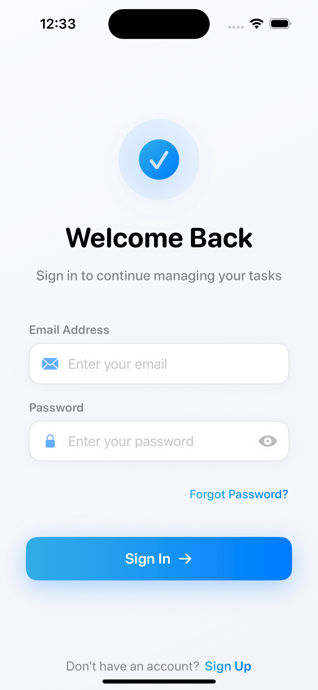
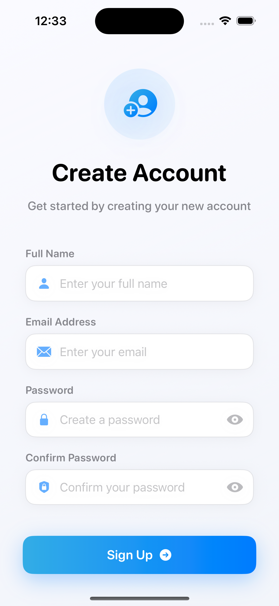
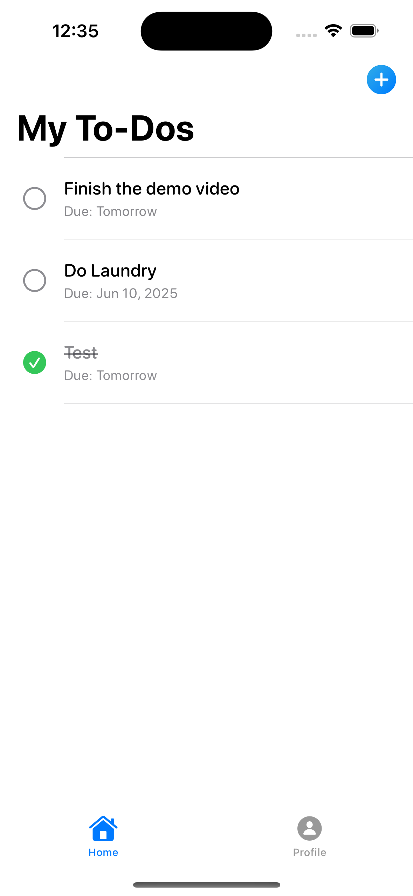
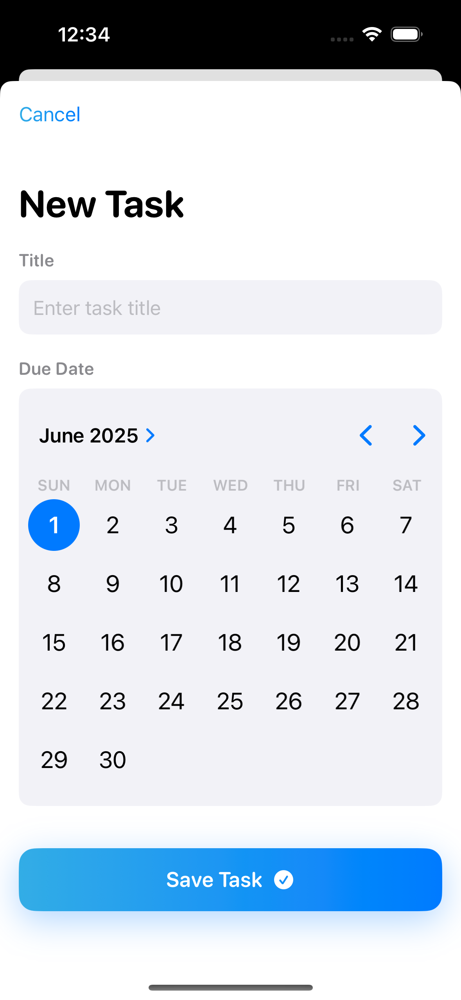
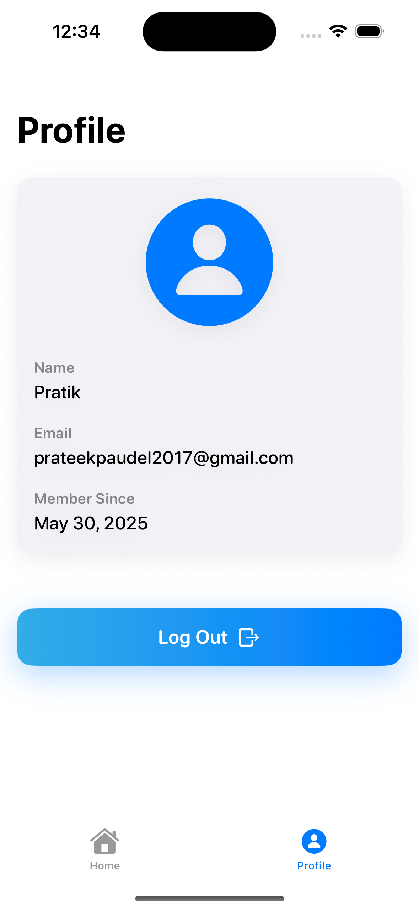

# ToDoList - SwiftUI Task Management App

ToDoList is a modern and sleek task management application built with SwiftUI, demonstrating core iOS development concepts including MVVM architecture, Firebase integration for authentication and real-time data storage, and adaptive UI for both light and dark modes.

## Video Walkthrough

Check out the full walkthrough of the app on YouTube:  
[](https://youtu.be/YLsLqRb6wAs)


## Features

### User Authentication
- Secure user registration with email and password
- User login with existing credentials
- Persistent login state across app launches
- Password reset functionality (placeholder)

### Task Management (CRUD Operations)
- **Create:** Add new tasks with a title and due date
- **Read:** View a list of all tasks, ordered by creation date
- **Update:** Mark tasks as complete or incomplete with a tap
- **Delete:** Swipe to delete tasks from the list

### Additional Features
- **Real-time Data Sync:** Tasks are stored in Firestore and sync in real-time across devices (if the user is logged into multiple devices with the same account)
- **User Profiles:** View user profile information (name, email, member since) and log out functionality
- **Modern UI/UX:** Sleek, adaptive interface that supports both Light and Dark modes with user-friendly input forms and intuitive navigation
- **Empty State Views:** Clean UI when no tasks are present
- **MVVM Architecture:** Built using the MVVM (Model-View-ViewModel) architectural pattern for clear separation of concerns with reusable UI components

## Screenshots

### 1. Authentication Flow (Login & Registration)



### 2. Main To-Do List View


### 3. Adding a New Task


### 4. Profile View


## Technologies Used

- **SwiftUI:** For building the user interface declaratively
- **Firebase:**
  - **Firebase Authentication:** For user login and registration
  - **Cloud Firestore:** As the NoSQL database for storing user data and to-do items in real-time
- **MVVM Architecture:** To structure the application logic
- **Swift Package Manager (SPM):** For managing Firebase dependencies

## Project Structure

The project follows a standard MVVM pattern:

```
ToDoList/
├── Models/                 # Data structures (User, ToDoListItem)
├── Views/                  # SwiftUI views for UI
│   ├── Components/         # Reusable components
│   │   ├── AuthButton.swift
│   │   ├── AuthTextField.swift
│   │   └── HeaderView.swift
│   └── Screens/           # Screen-level views
│       ├── LoginView.swift
│       ├── ToDoListView.swift
│       └── ProfileView.swift
├── ViewModels/            # ObservableObject classes for state management
├── Other/
│   ├── ToDoListApp.swift  # Main app entry point with Firebase initialization
│   ├── Extensions.swift   # Utility extensions
│   └── GoogleService-Info.plist  # Firebase configuration
└── Assets.xcassets        # Colors, app icons, etc.
```

## Setup and Configuration

### 1. Clone the Repository
```bash
git clone [your-repository-url]
cd ToDoList
```

### 2. Firebase Setup

1. Create a new Firebase project at [console.firebase.google.com](https://console.firebase.google.com)
2. Add an iOS app to your Firebase project
3. Register your app with its bundle ID (e.g., `com.yourdomain.ToDoList`)
4. Download the `GoogleService-Info.plist` file
5. Place the downloaded `GoogleService-Info.plist` file into the `ToDoList/Other/` directory in your Xcode project. Ensure it's added to the correct target
6. In the Firebase console, enable Authentication (Email/Password sign-in method)
7. Enable Cloud Firestore and set up your initial database (e.g., in test mode for development, then configure security rules)

### 3. Security Rules
Example for development (tighten for production):

```javascript
rules_version = '2';
service cloud.firestore {
  match /databases/{database}/documents {
    // Allow users to read and write their own data
    match /users/{userId}/{document=**} {
      allow read, write: if request.auth != null && request.auth.uid == userId;
    }
  }
}
```

### 4. Open in Xcode
1. Open the `.xcodeproj` file
2. Build and Run on a simulator or physical device

*Note: Dependencies are managed through Swift Package Manager (SPM), so Xcode handles Firebase SDK installation automatically.*

## Future Enhancements

- [ ] **Edit Tasks:** Allow users to modify existing task titles and due dates
- [ ] **Task Sorting & Filtering:** Options to sort tasks by due date, completion status, or filter by specific criteria
- [ ] **Task Categories/Tags:** Organize tasks into different categories
- [ ] **Reminders/Notifications:** Local notifications for task due dates
- [ ] **Enhanced Profile Customization:** Allow users to change their name or profile picture
- [ ] **Advanced Error Handling:** More user-friendly error messages and offline support
- [ ] **UI Animations and Polish:** Add subtle animations and transitions for a richer user experience
- [ ] **Testing:** Unit and UI tests implementation

## Contributing

Feel free to fork this repository, make changes, and submit pull requests. For major changes, please open an issue first to discuss what you would like to change.

## License

This project is licensed under the MIT License.

---

Built with ❤️ and SwiftUI
